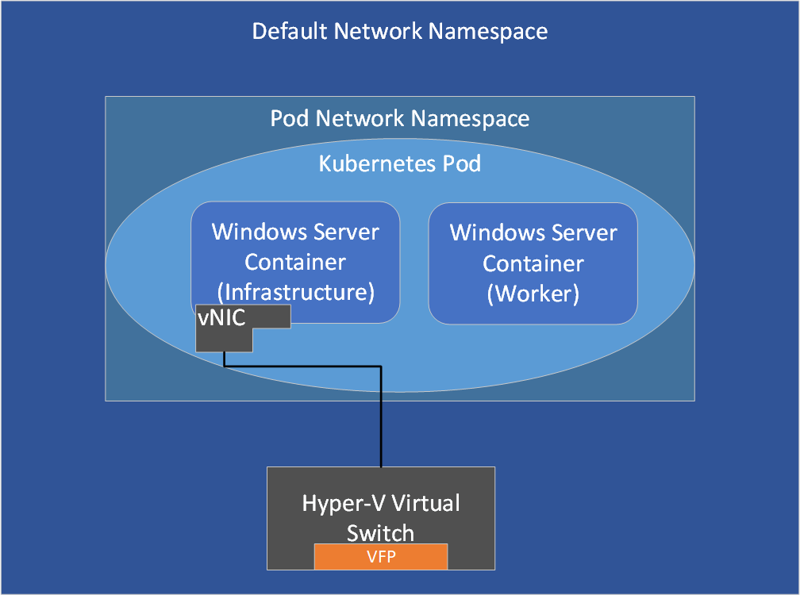

---
title: Windows Container Networking
description: Network isolation and security within Windows containers.
keywords: docker, containers
author: jmesser81
ms.date: 03/27/2018
ms.topic: article
ms.prod: windows-containers
ms.service: windows-containers
ms.assetid: 538871ba-d02e-47d3-a3bf-25cda4a40965
---


# Network Isolation and Security

## Isolation with Network namespaces
Each container endpoint is placed in its own __network namespace__. The management host vNIC and host network stack are located in the default network namespace. In order to enforce network isolation between containers on the same host, a network namespace is created for each Windows Server and Hyper-V Container into which the network adapter for the container is installed. Windows Server containers use a Host vNIC to attach to the virtual switch. Hyper-V Containers use a Synthetic VM NIC (not exposed to the Utility VM) to attach to the virtual switch.


```powershell 
Get-NetCompartment
```

## Network Security
Depending on which container and network driver is used, port ACLs are enforced by a combination of the Windows Firewall and [VFP](https://www.microsoft.com/en-us/research/project/azure-virtual-filtering-platform/).

### Windows Server containers
These use the Windows hosts' firewall (enlightened with network namespaces) as well as VFP
  * Default Outbound: ALLOW ALL
  * Default Inbound: ALLOW ALL (TCP, UDP, ICMP, IGMP) unsolicited network traffic
    * DENY ALL other network traffic not from these protocols

  > Note: Prior to Windows Server, version 1709 and Windows 10 Fall Creators Update, the default *inbound* rule was DENY all. Users running these older releases can create inbound ALLOW rules using ``docker run -p`` (port forwarding)


### Hyper-V containers
Hyper-V containers have their own isolated kernel and hence run their own instance of Windows Firewall with the following configuration:
  * Default ALLOW ALL in both Windows Firewall (running in the utility VM) and VFP


### Kubernetes Pods
In [Kubernetes pods](https://kubernetes.io/docs/concepts/workloads/pods/pod/), an infrastructure container is first created to which an endpoint is attached. Containers (including infrastructure and worker containers) belonging to the same pod share a common network namespace (same IP and port space).





### Customizing default port ACLs
If you wish to modify the default port ACLs, please reference our HNS documentation (link to be added soon). You will need to update policies inside the following components:

> NOTE: For Hyper-V Containers in Transparent and NAT mode, you cannot reprogram the default port ACLs currently. This is reflected by an "X" in the table.

| Network Driver | Windows Server Containers | Hyper-V Containers  |
| -------------- |-------------------------- | ------------------- |
| Transparent | Windows Firewall | X |
| NAT | Windows Firewall | X |
| L2Bridge | Both | VFP |
| L2Tunnel | Both | VFP |
| Overlay  | Both | VFP |